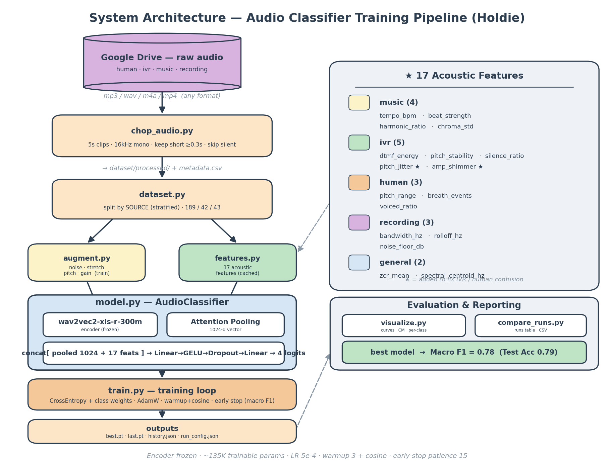

# סיווג אודיו של שיחות טלפון — דו"ח ניסויים

## 1. מטרה

אימון מודל למידת מכונה שמסווג קטעי אודיו של שיחות טלפון לאחת מארבע קטגוריות:

| קטגוריה | תיאור |
|---|---|
| `human` | נציג אנושי חי |
| `ivr` | תפריט אינטראקטיבי ("הקש 1 לעברית") |
| `music` | מוזיקת המתנה |
| `recording` | הקלטה / תא קולי / הודעה מוקלטת |

המודל נדרש לתמוך גם בקטעים קצרים מ-5 שניות (עד 0.3 שניות), כי נציגים אנושיים עונים לעיתים במילה בודדת ("היי", "שלום").

## 2. מאגר הנתונים

הניסויים נערכו על שתי גרסאות של המאגר:

### מאגר א' (ראשוני)
229 חתיכות לאחר חיתוך ל-5 שניות:

| קטגוריה | חתיכות |
|---|---|
| human | 103 |
| ivr | 54 |
| music | 60 |
| recording | **12** |

פיצול: אימון 158 / אימות 35 / בדיקה 36.

### מאגר ב' (מורחב)
274 חתיכות — לאחר הוספת הקלטות `recording`:

| קטגוריה | חתיכות |
|---|---|
| human | 103 |
| ivr | 54 |
| music | 60 |
| recording | **57** |

פיצול: אימון 189 / אימות 42 / בדיקה 43.

**הערה מתודולוגית:** הפיצול ל-train/val/test נעשה **לפי הקלטת מקור** (כל החתיכות מאותו קובץ הולכות לאותו פיצול) ועם stratification על הקטגוריה — כדי למנוע דליפת מידע (data leakage) שהייתה מנפחת את ציון הבדיקה.

## 3. ארכיטקטורת המודל



*דיאגרמת צינור האימון המלא: מקור הדאטה (Drive) → `chop_audio` → `dataset` (פיצול לפי מקור) → augmentation + 17 פיצ'רים → המודל (wav2vec2 קפוא + attention pooling + classifier) → `train` → פלט, וכלי ההערכה.*

```
אודיו גולמי (16kHz, mono)
      ↓
wav2vec2-xls-r-300m  (encoder מאומן מראש, רב-לשוני, 300M פרמטרים — מוקפא)
      ↓
Attention Pooling  (לומד אילו פריימים חשובים יותר)
      ↓
[concat: 15 פיצ'רים אקוסטיים מותאמי-קטגוריה]
      ↓
Linear(1024+15, 128) → GELU → Dropout(0.2) → Linear(128, 4)
      ↓
4 logits → Softmax → תחזית
```

- ה-encoder מוקפא; מתאמן רק ראש הסיווג (~133K פרמטרים מתוך 315M).
- Class weights מפצים על חוסר איזון בין הקטגוריות.
- Augmentations (רעש, time-stretch, pitch-shift, gain) על קבוצת האימון בלבד.
- Early stopping מבוסס macro F1 על קבוצת האימות.

### רכיבי הצינור (הסבר לדיאגרמה)

1. **Google Drive — raw audio** — מקור הדאטה. קבצי אודיו גולמיים בכל פורמט (mp3/wav/m4a/mp4), מאורגנים בתת-תיקיות לפי קטגוריה (`human/`, `ivr/`, `music/`, `recording/`).
2. **`chop_audio.py`** — חותך כל קובץ לחתיכות של 5 שניות (16kHz, mono, PCM16), שומר קליפים קצרים (≥0.3 שניות) במקום לדלג עליהם, מדלג על קטעים שקטים, וכותב `metadata.csv`.
3. **`dataset.py`** — טוען את ה-metadata ומפצל ל-train/val/test **לפי הקלטת מקור** (למניעת דליפת מידע) עם stratification על הקטגוריה.
4. **`augment.py`** — אוגמנטציות אקוסטיות (רעש, מתיחת זמן, pitch-shift, gain) על קבוצת האימון בלבד, להגדלת הגיוון.
5. **`features.py`** — מחשב 17 פיצ'רים אקוסטיים לכל קליפ, **פעם אחת** (על האודיו המקורי) ושומר במטמון, כי החישוב כבד מכדי לחזור עליו בכל אפוק.
6. **`model.py` — AudioClassifier** — ה-encoder של wav2vec2 (קפוא) מוציא ייצוג לכל פריים; **Attention Pooling** מאגד אותו לווקטור יחיד (1024-d); מחברים את 17 הפיצ'רים; ושכבת סיווג (Linear→GELU→Dropout→Linear) מפיקה 4 logits.
7. **`train.py`** — לולאת האימון: CrossEntropy עם class weights, אופטימייזר AdamW, לוח LR של warmup+cosine, ו-early stopping לפי macro F1. שומר `best.pt` ו-`run_config.json`.
8. **הערכה ודיווח** — `visualize.py` מפיק גרפי אימון ומטריצת בלבול; `compare_runs.py` בונה טבלת השוואה של כל הריצות (`comparison.csv`).

## 4. הפיצ'רים האקוסטיים (Feature Engineering)

17 פיצ'רים, כל אחד מכוון להבחנה של קטגוריה ומבוסס על אלגוריתם מקובל (librosa). כולם מנורמלים לסקלה פיזית קבועה ונחתכים לטווח `[-5, 5]`.

| קטגוריה יעד | פיצ'ר | אלגוריתם | הצדקה |
|---|---|---|---|
| music | `tempo_bpm` | beat tracking | מוזיקה בעלת קצב יציב |
| music | `beat_strength` | onset envelope | onset חזקים וסדירים |
| music | `harmonic_ratio` | HPSS | ספקטרום הרמוני נקי |
| music | `chroma_std` | chroma STFT | מגוון צלילים רחב |
| ivr | `dtmf_energy` | יחס אנרגיה בתדרי DTMF | צלילי חיוג |
| ivr | `pitch_stability` | std של pitch | קול סינתטי יציב |
| ivr | `silence_ratio` | יחס פריימים שקטים | פאוזות מובנות |
| ivr | `pitch_jitter` | הפרעת F0 בין פריימים | קול סינתטי "חלק" — jitter נמוך |
| ivr | `amp_shimmer` | הפרעת עוצמה בין פריימים | קול סינתטי "חלק" — shimmer נמוך |
| human | `pitch_range` | אחוזון 95−5 של pitch | טון דינמי |
| human | `breath_events` | זיהוי נשימות | נשימות אנושיות |
| human | `voiced_ratio` | יחס פריימים קוליים | דיבור חי |
| recording | `bandwidth_hz` | rolloff 99% | פסקול דחוס (codec) |
| recording | `rolloff_hz` | rolloff 85% | רולוף נמוך |
| recording | `noise_floor_db` | אחוזון 10 של אנרגיה | רצפת רעש קבועה |
| כללי | `zcr_mean` | zero-crossing rate | הבחנה רעש/דיבור/מוזיקה |
| כללי | `spectral_centroid_hz` | spectral centroid | בהירות ספקטרלית |

## 5. הניסויים

הגדרות קבועות בכל הריצות: מודל בסיס `wav2vec2-xls-r-300m`, batch size 8.

### טבלת כל הריצות

| # | מאגר | פיצ'רים | LR | unfreeze | patience | epochs | Test Acc | **Macro F1** |
|---|---|---|---|---|---|---|---|---|
| 1 | א' (rec=12) | 5 נשימה (לא מנורמל) | 1e-4 | 2 | 5 | 14 | 0.3889 | 0.2303 |
| 2 | א' (rec=12) | 5 נשימה (מנורמל) | 1e-4 | 2 | 5 | 7 | 0.2500 | 0.1000 |
| 3 | א' (rec=12) | **ללא** | 5e-4 | 0 | 15 | 33 | **0.9167** | **0.7094** |
| 4 | א' (rec=12) | 5 נשימה (מנורמל) | 5e-4 | 0 | 15 | 40 | 0.7500 | 0.5577 |
| 5 | ב' (rec=57) | 15 מותאמי-קטגוריה | 1e-4 | 2 | 5 | 11 | 0.4186 | 0.3440 |
| 6 | ב' (rec=57) | 15 מותאמי-קטגוריה | 5e-4 | 0 | 15 | 37 | 0.7674 | 0.7518 |
| 7 | ב' (rec=57) | ללא | 5e-4 | 0 | 15 | 21 | 0.5581 | 0.5426 |
| 8 | ב' (rec=57) | **17 (+jitter+shimmer)** | 5e-4 | 0 | 15 | 36 | **0.7907** | **0.7781** |

### F1 לכל קטגוריה

| # | פיצ'רים | human | ivr | music | recording |
|---|---|---|---|---|---|
| 1 | 5 נשימה (לא מנורמל) | 0.4348 | 0.0000 | 0.4865 | 0.0000 |
| 2 | 5 נשימה (מנורמל) | 0.0000 | 0.0000 | 0.4000 | 0.0000 |
| 3 | ללא | 0.9375 | 0.9000 | 1.0000 | 0.0000 |
| 4 | 5 נשימה (מנורמל) | 0.7692 | 0.4615 | 1.0000 | 0.0000 |
| 5 | 15 (הגדרות גרועות) | 0.4615 | 0.0000 | 0.5143 | 0.4000 |
| 6 | 15 (הגדרות נכונות) | 0.7692 | 0.5714 | 1.0000 | 0.6667 |
| 7 | ללא | 0.0000 | 0.5294 | 0.9412 | 0.7000 |
| 8 | **17 (+jitter+shimmer)** | 0.8125 | **0.8000** | 1.0000 | 0.5000 |

## 6. ניתוח

### 6.1 ההגדרות חשובות יותר מהמודל
ריצות 1–2 (LR=1e-4, unfreeze=2, patience=5) קרסו: ה-`train_loss` כמעט לא ירד (1.39 → 1.29), כלומר המודל לא הצליח ללמוד אפילו את קבוצת האימון. עצם המעבר ל-LR=5e-4, הקפאת ה-encoder המלאה (unfreeze=0) ו-patience=15 (ריצה 3) הקפיץ את ה-Macro F1 מ-0.10 ל-0.71 — **על אותו מודל ואותו דאטה**. מסקנה: על מאגר קטן, fine-tuning של שכבות encoder מזיק (יותר מדי פרמטרים), ו-LR נמוך מדי מונע מראש הסיווג להתכנס.

### 6.2 ערך ה-Feature Engineering תלוי בדאטה
ממצא מרכזי ולא-טריוויאלי:

| מאגר | בלי פיצ'רים | עם פיצ'רים |
|---|---|---|
| א' (rec=12) | **0.7094** (ריצה 3) | 0.5577 (ריצה 4, 5 נשימה) |
| ב' (rec=57) | 0.5426 (ריצה 7) | **0.7518** (ריצה 6, 15 מותאמים) |

- **על מאגר א' הקטן והלא-מאוזן, הפיצ'רים הזיקו** — wav2vec2 לבד הספיק, והפיצ'רים (5 פיצ'רי נשימה, כולם על "דיבור אנושי") רק בלבלו את ההבחנה בין `ivr` ל-`human`.
- **על מאגר ב' המורחב, הפיצ'רים הפכו לקריטיים** — בלעדיהם המודל **קרס לחלוטין על `human`** (F1=0.00: כל 15 ההקלטות האנושיות סווגו כ-ivr או recording). הפיצ'רים העלו את human מ-0.00 ל-0.77.

ההסבר: ככל שהמאגר גדל והתאזן (recording 12→57), המשימה נעשתה קשה יותר — ארבע קטגוריות שכולן (חוץ ממוזיקה) מכילות דיבור. במצב הזה, פיצ'רים גלובליים מותאמי-קטגוריה (tempo, DTMF, רוחב-פס, דינמיקת pitch) מספקים אות משלים ש-wav2vec2 — המאומן על דיבור — לא תופס לבדו.

### 6.3 השפעת הוספת הדאטה ל-recording
בכל הריצות על מאגר א' (recording=12), קטגוריית `recording` קיבלה F1=0.00 — 8 דוגמאות אימון פשוט לא הספיקו. לאחר ההרחבה ל-57, `recording` הגיע ל-F1=0.67–0.70. זו הדגמה ישירה לחשיבות כמות הדוגמאות לכל מחלקה.

### 6.4 חיזוק פיצ'רי IVR — jitter ו-shimmer (ריצה 8)
בריצה 6 קטגוריית `ivr` הייתה החלשה (F1=0.57, recall 0.40) — IVR בלבל עם human, כי שניהם דיבור. הוספנו שני מדדי איכות-קול קלאסיים שמכוונים להבחנה בין **קול סינתטי לקול טבעי**:

- **`pitch_jitter`** — הפרעת F0 בין פריימים.
- **`amp_shimmer`** — הפרעת עוצמה בין פריימים.

קול סינתטי (IVR) "חלק" — בעל jitter ו-shimmer נמוכים מאוד; קול אנושי טבעי בעל ערכים גבוהים יותר. התוצאה (ריצה 8):

| קטגוריה | ריצה 6 (15 פיצ'רים) | ריצה 8 (17 פיצ'רים) |
|---|---|---|
| ivr F1 | 0.5714 | **0.8000** (+0.23) |
| human F1 | 0.7692 | 0.8125 |
| **Macro F1** | 0.7518 | **0.7781** |
| recording F1 | 0.6667 | 0.5000 |

ה-IVR נפתר (recall עלה מ-0.40 ל-0.80). אך נוצר **trade-off**: `recording` (תא קולי) הוא **קול אנושי מוקלט** — יש לו jitter ו-shimmer טבעיים בדיוק כמו human, ולכן הפיצ'רים החדשים גורמים ל-recording להיראות יותר כמו human. `recording` הפך לחוליה החלשה (F1=0.50). נטו — שיפור: Macro F1 עלה מ-0.75 ל-**0.78**.

## 7. מטריצות בלבול (ריצות מרכזיות, מאגר ב')

**ריצה 6 — 15 פיצ'רים:**
```
              חיזוי
אמת       human  ivr  music  recording
human       15    0     0      0
ivr          5    4     0      1
music        0    0     9      0
recording    4    0     0      5
```

**ריצה 7 — בלי פיצ'רים:**
```
              חיזוי
אמת       human  ivr  music  recording
human        0   12     0      3      ← קריסה מוחלטת על human
ivr          0    9     0      1
music        0    1     8      0
recording    0    2     0      7
```

**ריצה 8 — 17 פיצ'רים (+jitter+shimmer) — המודל הנבחר:**
```
              חיזוי
אמת       human  ivr  music  recording
human       13    1     0      1
ivr          0    8     0      2      ← IVR שוקם (8/10)
music        0    0     9      0
recording    4    1     0      4      ← recording מתבלבל עם human
```

## 8. מסקנות

1. **המודל הנבחר: ריצה 8** — wav2vec2-xls-r-300m מוקפא + attention pooling + 17 פיצ'רים אקוסטיים, על המאגר המורחב. **דיוק 79.1%, Macro F1 = 0.78.**
2. **Feature engineering תורם** על המאגר הנוכחי: +0.24 ב-Macro F1 לעומת המודל בלי פיצ'רים (ריצה 7), והצלת קטגוריית `human` מקריסה.
3. **חיזוק פיצ'רים ממוקד עובד**: הוספת jitter+shimmer (ריצה 6→8) קפצה את `ivr` מ-F1=0.57 ל-0.80.
4. **כיוונון hyperparameters קריטי**: אותם פיצ'רים עם הגדרות שגויות נתנו רק 0.34.
5. **כמות הדאטה לכל מחלקה מכריעה**: `recording` עבר מ-F1=0 (8 דוגמאות) ל-F1=0.50–0.67 (39 דוגמאות).

## 9. מגבלות וכיווני המשך

- **`recording` הוא כעת החלש** (F1=0.50) — מתבלבל עם `human`. ההבחנה קשה כי תא קולי הוא קול אנושי מוקלט; ההבדל הוא הערוץ ולא הקול. כיוונים: עוד דאטה ל-recording, או פיצ'רים לזיהוי ערוץ הקלטה (ביפ פתיחה, רוורב, דחיסת codec, רעש רקע אחיד).
- **`ivr` שוקם** (F1=0.80 בריצה 8) בזכות jitter+shimmer, אך עדיין יש מקום לשיפור.
- **מאגר קטן יחסית** (274 חתיכות) — ביצועים עשויים להשתפר עם עוד דאטה ובדיקה על מאגר חיצוני.
